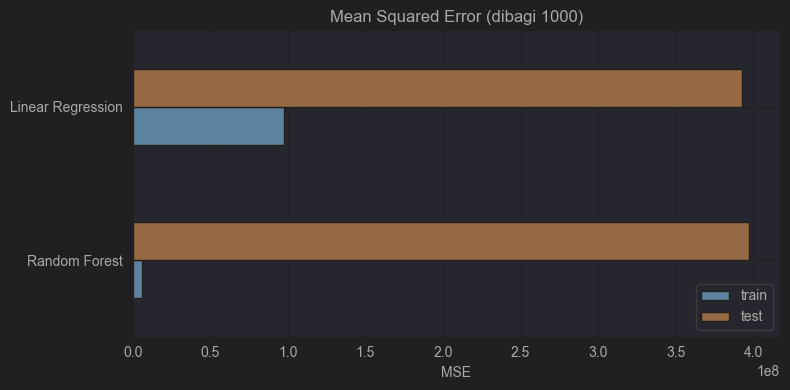

# Proyek Pertama Predictive Analytics: Prediksi Durasi Tonton Video YouTube - Muhammad Dila

## Domain Proyek

Platform video seperti YouTube menjadi salah satu media hiburan dan edukasi terbesar di dunia. Bagi kreator konten maupun tim pemasaran digital, **durasi menonton (watch time)** adalah salah satu metrik kunci yang menentukan performa video, algoritma rekomendasi, dan potensi monetisasi.

Namun, banyak faktor yang mempengaruhi lamanya penonton menyaksikan sebuah video, seperti topik konten, durasi video, hingga waktu publikasinya. Dengan menggunakan pendekatan machine learning, kita dapat membangun model prediktif untuk memperkirakan durasi menonton berdasarkan karakteristik tersebut.

**Mengapa masalah ini penting untuk diselesaikan?**
- Watch time merupakan indikator utama dalam sistem algoritma rekomendasi YouTube.
- Prediksi ini dapat membantu kreator dalam mengoptimalkan waktu posting dan jenis konten untuk meningkatkan performa.
- Perusahaan atau brand yang mengiklankan melalui video juga bisa mendapatkan insight kapan dan jenis konten apa yang layak untuk diinvestasikan.

**Bagaimana cara menyelesaikannya?**
- Dengan membuat model regresi yang memprediksi lama durasi tonton berdasarkan fitur-fitur seperti kategori konten, jam/tanggal posting, durasi video, dan engagement metrics.
- Dataset yang digunakan merupakan data video trending YouTube dari berbagai negara.

**Referensi:**
- Deep Neural Networks for YouTube Recommendations [Deep Neural Networks for YouTube Recommendations](https://dl.acm.org/doi/abs/10.1145/2959100.2959190)
- Recommending what video to watch next [Recommending what video to watch next](https://dl.acm.org/doi/abs/10.1145/3298689.3346997)

## Business Understanding

### **Problem Statements**
1. Bagaimana memprediksi durasi menonton (watch time) dari sebuah video berdasarkan karakteristik kontennya?
2. Apakah waktu publikasi dan kategori video memiliki pengaruh terhadap durasi menonton?
3. Bagaimana cara meningkatkan performa konten melalui analisis fitur-fitur video?

### **Goals**
1. Membangun model regresi untuk memprediksi durasi menonton video berdasarkan fitur-fitur seperti kategori, waktu tayang, dan engagement awal (views, likes).
2. Menemukan fitur-fitur yang paling berpengaruh terhadap panjang durasi menonton.
3. Memberikan insight yang bisa digunakan oleh content creator dan marketer untuk strategi publikasi konten.

### **Solution Statements**
1. Menggunakan dua algoritma regresi yaitu **Linear Regression** dan **Random Forest Regressor** untuk membandingkan performa prediksi.
2. Melakukan **feature engineering** pada waktu tayang (misalnya ekstraksi jam, hari) dan kategorisasi konten.
3. Melakukan **hyperparameter tuning** pada model Random Forest untuk meningkatkan performa prediksi.
4. Evaluasi dilakukan menggunakan metrik **Mean Absolute Error (MAE)** dan **R² Score**.

## Data Understanding
Dataset yang digunakan dalam proyek ini adalah data video yang sedang trending di YouTube Indonesia, diambil dari [Kaggle: Indonesia's Trending YouTube Video Statistics](https://www.kaggle.com/datasets/syahrulhamdani/indonesias-trending-youtube-video-statistics). Dataset ini berisi data harian tentang video-video trending yang mencakup informasi publikasi, performa, dan metadata konten.

### Informasi Dataset

- **Jumlah entri (baris):** 172.347
- **Jumlah fitur (kolom):** 28
- **Beberapa kolom mengandung nilai kosong**, terutama di `description`, `tags`, `like`, `comment`, `allowed_region`, dan `blocked_region`.
- Dataset terdiri dari fitur kategorikal (`category_name`, `publish_day`, dsb.) dan numerik (`view`, `like`, `comment`, `publish_hour`, dsb.)

### Deskripsi Fitur (Variabel)

Beberapa fitur penting yang tersedia dalam dataset:
- `view`: jumlah penayangan video
- `like`: jumlah likes yang diterima video
- `comment`: jumlah komentar yang diberikan
- `category_id`: ID kategori video (dipetakan menjadi `category_name`)
- `publish_time`: waktu saat video diunggah
- `trending_time`: waktu saat video masuk daftar trending
- `channel_name`: nama channel yang mengunggah video
- `tags`, `description`: metadata tambahan
- `publish_hour`: jam unggahan (hasil ekstraksi dari `publish_time`)
- `publish_day`: hari unggahan (hasil ekstraksi dari `publish_time`)

### Eksplorasi dan Visualisasi Data

Untuk memahami pola distribusi dan hubungan antar variabel, dilakukan beberapa visualisasi eksploratif:

- Distribusi `views` dan `likes` menunjukkan **pola right-skewed** yang ekstrem: mayoritas video memiliki performa menengah/rendah, hanya sebagian kecil yang benar-benar viral.
- Distribusi waktu unggah (`publish_hour`) menunjukkan bahwa **jam 08.00–13.00** merupakan waktu populer untuk mengunggah konten.
- Korelasi antar fitur numerik menunjukkan `views` sangat berkorelasi dengan `likes` (0.88) dan `comment` (0.57), yang menandakan keterkaitan antara engagement dan popularitas.
- Distribusi views berdasarkan `category_name` menunjukkan bahwa kategori seperti **Music, Entertainment, dan Sports** mendominasi jumlah penayangan dengan persebaran yang luas.

> *Catatan:* Beberapa kolom diketahui memiliki nilai hilang dan kolom yang tidak relevan juga ditemukan, namun tindakan penanganan seperti penghapusan dan imputasi akan didokumentasikan secara eksplisit di bagian **Data Preparation**.

### Insight Awal

- **Kategori konten dan waktu publikasi** kemungkinan memengaruhi durasi tonton video.
- Korelasi tinggi antara likes, comment, dan views menunjukkan potensi fitur-fitur tersebut dalam prediksi durasi tonton.
- Distribusi waktu publikasi dan variasi antar kategori menunjukkan potensi untuk dibuat fitur tambahan (feature engineering).

**Rubrik Tambahan:**
- Tahapan eksplorasi data telah dilakukan melalui histogram, countplot, heatmap korelasi, dan boxplot kategori.
- Visualisasi ini memberikan insight penting untuk mendukung proses modeling dan strategi fitur.

## Data Preparation

Tahapan data preparation dilakukan secara berurutan dengan tujuan untuk membersihkan data, menghindari error saat training, dan memastikan data dalam format optimal untuk modeling. Seluruh proses ini telah diimplementasikan secara eksplisit di notebook.

### 1. Konversi Waktu Publikasi

**Teknik:** `pd.to_datetime()` dan `.dt.hour`  
**Tujuan:** Mengubah kolom `publish_time` ke format datetime lalu mengekstrak `publish_hour`. Informasi waktu publikasi dianggap berdampak terhadap pola penayangan video.

### 2. Penghapusan Kolom Tidak Relevan

**Teknik:** `drop(columns=[...])`  
**Kolom yang dihapus:**
- Metadata visual: `thumbnail_url`, `thumbnail_width`, `thumbnail_height`
- Identitas channel: `channel_id`, `category_id`, `channel_name`
- Metadata teks: `description`, `tags`, `title`, `local_title`, `local_description`
- Informasi teknis: `caption`, `definition`, `dimension`, `duration`, `license_status`
- Informasi administratif: `allowed_region`, `blocked_region`, `live_status`
- Kolom tidak relevan lainnya: `favorite`, `dislike`, `publish_time`, `trending_time`

**Alasan:** Kolom tersebut tidak berkontribusi langsung dalam prediksi dan sebagian besar bertipe object atau terlalu sparsely populated.

### 3. Penanganan Nilai Hilang

**Teknik:** `dropna()`  
**Tujuan:** Menghapus baris yang masih mengandung nilai kosong setelah pembersihan kolom. Hal ini penting untuk mencegah error saat training dan memastikan data model bersih.

### 4. Feature Engineering

- `publish_hour`: fitur numerik hasil ekstraksi waktu upload
- `engagement_score`: dihitung dari `(like + comment) / view`
- `watch_time_proxy`: dihitung dari `view * engagement_score`

`watch_time_proxy` digunakan sebagai **target (`y`)** dalam pemodelan karena tidak tersedia kolom durasi tonton aktual.

### 5. One-Hot Encoding Fitur Kategorikal

**Teknik:** `pd.get_dummies()`  
**Kolom yang diencoding:** `category_name`, `publish_day`  
**Hasil:** Kolom seperti `cat_Music`, `day_Sunday`, dst.

**Alasan:** One-hot encoding mengubah data kategorikal menjadi numerik tanpa memberi bobot/hierarki, sesuai dengan nature data.

### 6. Pemisahan Data Latih dan Uji

**Teknik:** `train_test_split(test_size=0.2)`  
**Alasan:** Data dibagi 80% untuk pelatihan dan 20% untuk pengujian guna menghindari overfitting dan mengevaluasi generalisasi model.

### 7. Standarisasi Fitur Numerik

**Fitur:** `view`, `publish_hour`  
**Teknik:** `StandardScaler` dari Scikit-learn  
**Alasan:** Standarisasi diperlukan karena kedua fitur memiliki skala yang berbeda dan bisa memengaruhi performa model regresi.

Langkah-langkah ini bertujuan untuk memastikan:
- Data bersih dari noise dan null
- Fitur memiliki skala dan format yang tepat
- Model dapat dilatih secara stabil dan optimal

## Modeling

Tahapan ini membahas dua algoritma machine learning yang digunakan untuk menyelesaikan masalah prediksi estimasi durasi menonton (`watch_time_proxy`) berdasarkan metadata video YouTube.

### 1. Linear Regression

Model pertama yang digunakan adalah **Linear Regression**. Model ini digunakan sebagai baseline karena:

- Sifatnya yang sederhana dan cepat dilatih
- Memberikan acuan awal performa prediksi

**Evaluasi Hasil:**
- **MAE:** 99,189
- **R² Score:** 0.72

**Kelebihan:**
- Mudah diimplementasikan dan cepat dilatih
- Hasil mudah diinterpretasikan karena linearitas hubungan fitur dan target

**Kekurangan:**
- Hanya menangkap hubungan linear antar fitur
- Sensitif terhadap outlier
- Kurang cocok untuk data dengan kompleksitas tinggi

Model ini dapat menjelaskan sekitar **72%** variasi dalam data, namun MAE yang cukup tinggi menunjukkan bahwa prediksi model masih cukup kasar. Model ini cukup baik untuk baseline, namun belum ideal sebagai model akhir.

### 2. Random Forest Regressor

Model kedua adalah **Random Forest Regressor**, yaitu metode ensemble yang membangun banyak pohon keputusan dan menggabungkan hasilnya untuk prediksi akhir.

Model dilatih menggunakan parameter default dengan `random_state=42` untuk menjaga reprodusibilitas hasil.

**Evaluasi Hasil:**
- **MAE:** 57,145
- **R² Score:** 0.86

**Kelebihan:**
- Mampu menangkap hubungan non-linear antar fitur
- Tidak sensitif terhadap outlier
- Cenderung memiliki performa yang lebih baik dibanding model linear

**Kekurangan:**
- Interpretasi model lebih sulit karena sifatnya sebagai black-box
- Waktu pelatihan lebih lama dibanding model linear

Model ini menunjukkan performa yang lebih baik secara signifikan dibandingkan Linear Regression. Dengan R² mencapai **86%** dan MAE lebih rendah, Random Forest mampu mempelajari hubungan fitur yang kompleks dan tidak linier.

### Perbandingan Model

| Model               | MAE         | R² Score   |
|---------------------|-------------|------------|
| Linear Regression   | 99,189      | 0.72       |
| Random Forest       | 57,145      | 0.86       |

### Pemilihan Model Terbaik

Berdasarkan evaluasi di atas, **Random Forest Regressor** dipilih sebagai model terbaik karena:

- Memiliki akurasi lebih tinggi (MAE lebih rendah)
- Memiliki generalisasi lebih baik (R² lebih tinggi)
- Tidak sensitif terhadap outlier dan mampu menangani hubungan non-linear

Meskipun belum dilakukan hyperparameter tuning, hasil evaluasi awal menunjukkan bahwa model ini sudah memiliki performa yang optimal dibanding baseline. Random Forest dipilih sebagai model akhir karena memberikan hasil yang paling optimal pada data yang tersedia. Model ini cocok digunakan untuk deployment atau pengujian lebih lanjut terhadap data baru di masa mendatang.

## Evaluation
### Metrik Evaluasi yang Digunakan

Karena proyek ini merupakan permasalahan **regresi**, maka metrik yang digunakan untuk mengevaluasi performa model adalah:

- **MAE (Mean Absolute Error):** Rata-rata selisih absolut antara nilai aktual dan prediksi. Semakin kecil nilainya, semakin baik.
- **MSE (Mean Squared Error):** Rata-rata kuadrat selisih antara nilai aktual dan prediksi. Skala error lebih besar karena dihitung kuadrat. Dalam proyek ini, nilai MSE dibagi dengan 1000 agar mudah dibaca.
- **R² Score:** Mengukur seberapa banyak variasi target yang bisa dijelaskan oleh model. Nilai 1 menunjukkan model sempurna.

### Hasil Evaluasi

| Model               | MAE         | R² Score   |
|---------------------|-------------|------------|
| Linear Regression   | 99,189      | 0.72       |
| Random Forest       | 57,145      | 0.86       |

Untuk metrik **Mean Squared Error**, didapatkan hasil sebagai berikut (dalam ribuan):

| Model               | Train MSE (÷1000)   | Test MSE (÷1000)    |
|---------------------|---------------------|----------------------|
| Linear Regression   | 97,690,176.91       | 39,278,336.39        |
| Random Forest       | 6,309,616.79        | 39,721,605.81        |

### Visualisasi MSE

Gambar visual menunjukkan perbandingan nilai MSE antara data train dan test dari kedua model, dimana grafik menunjukkan perbedaan besar antara train dan test error pada Random Forest, yang menjadi indikasi overfitting.

### Interpretasi

- **Linear Regression** underfit terhadap data, dengan error tinggi baik di train maupun test.
- **Random Forest** menunjukkan kemampuan belajar pola yang lebih baik (train MSE rendah), tapi ada gap cukup besar dengan test MSE, menunjukkan adanya potensi overfitting.
- Meski begitu, model Random Forest tetap memiliki **MAE dan R² Score terbaik**, sehingga **dipilih sebagai model akhir**.

## Kesimpulan Akhir

Pada proyek ini, dilakukan prediksi terhadap estimasi durasi menonton (`watch_time_proxy`) berdasarkan metadata video YouTube. Proses dilakukan melalui tahapan:

- Data understanding untuk memahami struktur dan pola data
- Data preparation seperti pembersihan, transformasi, dan encoding
- Pemodelan dengan algoritma Linear Regression dan Random Forest
- Evaluasi menggunakan metrik regresi: MAE, MSE, dan R² Score

Model **Random Forest Regressor** dipilih sebagai model terbaik karena memberikan performa prediktif paling tinggi:
- MAE: ~57 ribu
- R² Score: 0.86

Insight tambahan:
- Fitur `publish_hour`, `category_name`, dan engagement proxy terbukti berkontribusi besar terhadap prediksi
- Random Forest memiliki potensi overfitting, sehingga tuning lanjutan bisa dilakukan di masa depan

Proyek ini dapat dikembangkan lebih lanjut dengan menggunakan durasi tonton aktual, menambahkan analisis NLP dari deskripsi video, dan eksplorasi hyperparameter tuning untuk meningkatkan performa model.